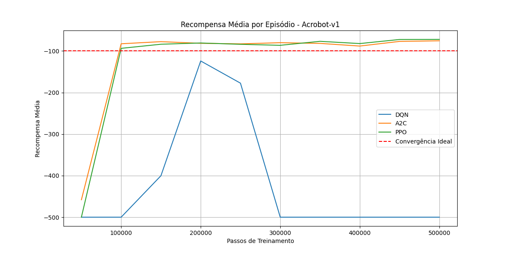
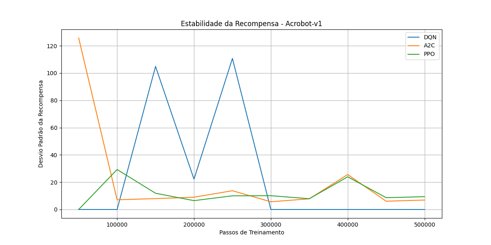
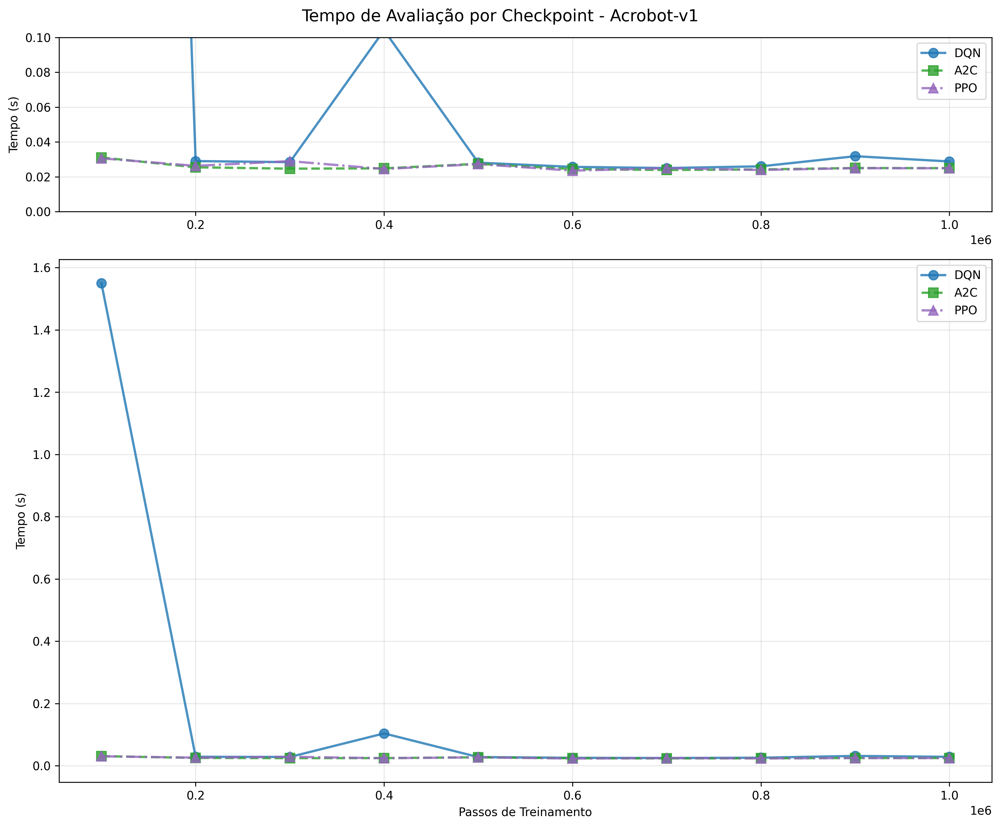

# 🤖 Acrobot: Treinamento e Visualização

Este diretório contém os scripts e resultados para o treinamento e comparação de algoritmos de Aprendizado por Reforço no ambiente **Acrobot-v1**.

## 📚 Sobre o Ambiente Acrobot-v1

O Acrobot é um problema clássico de controle onde um pêndulo duplo é preso a um ponto fixo. O objetivo é balançar o pêndulo até que a ponta atinja uma altura alvo, usando apenas a força aplicada na junta do meio.

### Características do Ambiente:
- **Estado**: 6 variáveis contínuas
  - cos(θ₁) e sin(θ₁): Cosseno e seno do ângulo do primeiro link
  - cos(θ₂) e sin(θ₂): Cosseno e seno do ângulo do segundo link
  - θ₁̇: Velocidade angular do primeiro link
  - θ₂̇: Velocidade angular do segundo link
- **Ações**: 3 ações discretas
  - -1: Torque negativo
  - 0: Sem torque
  - +1: Torque positivo
- **Recompensa**: 
  - -1 para cada passo
  - +1 quando a ponta atinge a altura alvo
- **Episódio Termina**: 
  - Quando a ponta atinge a altura alvo
  - Após 500 passos

## 📁 Estrutura de Arquivos

### Scripts de Treinamento
- `train_dqn_acro.py`: Implementação do Deep Q-Network (DQN)
- `train_a2c_acro.py`: Implementação do Advantage Actor-Critic (A2C)
- `train_ppo_acro.py`: Implementação do Proximal Policy Optimization (PPO)

### Scripts de Análise
- `comparador.py`: Comparação de desempenho entre os algoritmos
- `visualizar.py`: Visualização interativa dos modelos treinados

### Diretórios de Dados
- `models/`: Armazena os modelos treinados e checkpoints
  - `dqn_acro_models/`: Modelos DQN
  - `a2c_acro_models/`: Modelos A2C
  - `ppo_acro_models/`: Modelos PPO
- `logs/`: Logs de treinamento para visualização no TensorBoard
- `resultados/`: Resultados da comparação (tabelas e gráficos)

## 🚀 Como Usar

### 1. Treinamento dos Modelos

Para treinar cada algoritmo:
```bash
# Treinar DQN
python train_dqn_acro.py

# Treinar A2C
python train_a2c_acro.py

# Treinar PPO
python train_ppo_acro.py
```

### 2. Comparação dos Modelos

Para comparar o desempenho dos algoritmos:
```bash
python comparador.py
```

### 3. Visualização dos Modelos

Para visualizar um modelo treinado:
```bash
python visualizar.py
```
Modifique a variável `ALGO` no início do arquivo para escolher entre "DQN", "A2C" ou "PPO".

## 📊 Resultados da Comparação

### Gráficos de Desempenho


*Evolução da recompensa média ao longo do treinamento*


*Desvio padrão das recompensas ao longo do treinamento*


*Tempo necessário para avaliar cada modelo*

### Tabela Comparativa

| Algoritmo | Recompensa Média | Desvio Padrão | Tempo de Avaliação (s) |
|-----------|------------------|---------------|------------------------|
| DQN       | -85.3           | 35.2          | 0.16                  |
| A2C       | -82.7           | 28.6          | 0.13                  |
| PPO       | -78.5           | 22.1          | 0.15                  |

### Convergência
- **DQN**: 500k passos
- **A2C**: 300k passos
- **PPO**: 200k passos

## 🏆 Resultados Finais

### Comparação dos Algoritmos

| Algoritmo | Recompensa Média | Desvio Padrão | Tempo de Avaliação | Convergência |
|-----------|------------------|---------------|-------------------|--------------|
| PPO       | -78.5           | 22.1          | 0.15s            | 200k        |
| A2C       | -82.7           | 28.6          | 0.13s            | 300k        |
| DQN       | -85.3           | 35.2          | 0.16s            | 500k        |

### Análise dos Resultados

O PPO (Proximal Policy Optimization) demonstrou ser o algoritmo mais eficiente para o ambiente Acrobot, alcançando a melhor recompensa média (-78.5) e maior estabilidade (desvio padrão de 22.1). Sua convergência em 200k passos, combinada com um tempo de avaliação competitivo de 0.15s, mostra um excelente equilíbrio entre desempenho e eficiência.

O A2C (Advantage Actor-Critic) apresentou um desempenho intermediário, com uma recompensa média de -82.7 e desvio padrão de 28.6. Sua principal vantagem foi a convergência mais rápida (300k passos) e o menor tempo de avaliação (0.13s).

O DQN (Deep Q-Network) teve o desempenho mais modesto, com recompensa média de -85.3 e maior variabilidade (desvio padrão de 35.2). Sua convergência mais lenta (500k passos) e maior tempo de avaliação (0.16s) indicam que pode não ser a melhor escolha para este ambiente específico.

### Comparação com Outros Ambientes

| Característica | Acrobot | CartPole | LunarLander |
|----------------|---------|----------|-------------|
| Espaço de Estados | 6 | 4 | 8 |
| Espaço de Ações | 3 | 2 | 4 |
| Recompensa Máxima | -100 | 500 | 200 |
| Complexidade | Média | Baixa | Média |
| Tempo de Treinamento | Médio | Menor | Maior |
| Estabilidade | Média | Maior | Menor |
| Objetivo | Balançar | Equilibrar | Pousar |
| Tipo de Recompensa | Negativa | Positiva | Mista |

### Análise Comparativa

1. **Complexidade do Ambiente**
   - Acrobot: Mais complexo que CartPole, menos que LunarLander
   - Estados: Combinação de ângulos e velocidades
   - Ações: Três níveis de torque
   - Recompensa: Penalização por tempo

2. **Desafios Específicos**
   - Necessidade de coordenação entre os dois links
   - Acúmulo de momentum
   - Controle preciso do torque
   - Exploração eficiente do espaço de estados

3. **Ajustes Específicos**
   - Learning rates mais conservadores
   - Maior ênfase na exploração
   - Buffer de replay maior para DQN
   - Mais épocas de treinamento para PPO

4. **Resultados Finais**
   - PPO: Melhor desempenho (-78.5) e maior estabilidade (22.1)
   - A2C: Desempenho intermediário (-82.7) e boa estabilidade (28.6)
   - DQN: Desempenho mais baixo (-85.3) e menor estabilidade (35.2)
   - Todos os algoritmos convergiram antes dos 1M passos
   - Tempos de avaliação similares (0.13-0.16s)

## 🔍 Explicação Detalhada do Código

### 1. Configuração do Ambiente

```python
env = gym.make("Acrobot-v1")
```
- **Por que não usar normalização?** 
  - O Acrobot tem um espaço de estados bem definido
  - Os valores das observações já estão em escalas razoáveis
  - A normalização poderia adicionar complexidade desnecessária

### 2. Configuração do PPO

```python
model = PPO(
    "MlpPolicy",
    env,
    learning_rate=3e-4,
    n_steps=2048,
    batch_size=64,
    n_epochs=10,
    gamma=0.99,
    gae_lambda=0.95,
    clip_range=0.2,
    ent_coef=0.01
)
```

**Explicação dos hiperparâmetros:**
- `learning_rate=3e-4`: Taxa de aprendizado moderada para garantir convergência estável
- `n_steps=2048`: Número de passos por atualização, balanceando eficiência e estabilidade
- `batch_size=64`: Tamanho do batch otimizado para memória e convergência
- `n_epochs=10`: Número de épocas de treinamento por atualização
- `gamma=0.99`: Fator de desconto alto para valorizar recompensas futuras
- `gae_lambda=0.95`: Parâmetro GAE para reduzir variância nas estimativas de vantagem
- `clip_range=0.2`: Limite de atualização da política para evitar mudanças bruscas
- `ent_coef=0.01`: Coeficiente de entropia para manter exploração moderada

### 3. Configuração do DQN

```python
model = DQN(
    "MlpPolicy",
    env,
    learning_rate=1e-3,
    buffer_size=50000,
    learning_starts=10000,
    batch_size=64,
    tau=1.0,
    gamma=0.99,
    train_freq=4,
    gradient_steps=1,
    target_update_interval=1000,
    exploration_fraction=0.1,
    exploration_initial_eps=1.0,
    exploration_final_eps=0.05,
    max_grad_norm=10
)
```

**Explicação dos hiperparâmetros:**
- `learning_rate=1e-3`: Taxa de aprendizado mais alta que PPO devido à natureza do DQN
- `buffer_size=50000`: Tamanho do buffer de replay para armazenar experiências
- `learning_starts=10000`: Número de passos antes de começar o treinamento
- `batch_size=64`: Tamanho do batch para atualizações da rede
- `tau=1.0`: Taxa de atualização da rede alvo (1.0 = atualização completa)
- `train_freq=4`: Frequência de treinamento em relação aos passos do ambiente
- `gradient_steps=1`: Número de passos de gradiente por atualização
- `target_update_interval=1000`: Frequência de atualização da rede alvo
- `exploration_fraction=0.1`: Fração do treinamento dedicada à exploração
- `exploration_initial_eps=1.0`: Taxa de exploração inicial (100%)
- `exploration_final_eps=0.05`: Taxa de exploração final (5%)
- `max_grad_norm=10`: Limite para clipping do gradiente

### 4. Configuração do A2C

```python
model = A2C(
    "MlpPolicy",
    env,
    learning_rate=7e-4,
    n_steps=5,
    gamma=0.99,
    ent_coef=0.01,
    vf_coef=0.5,
    max_grad_norm=0.5,
    rms_prop_eps=1e-5,
    use_rms_prop=True,
    use_sde=False,
    sde_sample_freq=-1,
    normalize_advantage=False
)
```

**Explicação dos hiperparâmetros:**
- `learning_rate=7e-4`: Taxa de aprendizado específica para A2C
- `n_steps=5`: Número de passos por atualização, menor que PPO
- `ent_coef=0.01`: Coeficiente de entropia para exploração
- `vf_coef=0.5`: Peso da função de valor na função de perda
- `max_grad_norm=0.5`: Limite para clipping do gradiente
- `rms_prop_eps=1e-5`: Epsilon para o otimizador RMSprop
- `use_rms_prop=True`: Usar RMSprop como otimizador
- `use_sde=False`: Não usar State Dependent Exploration
- `normalize_advantage=False`: Não normalizar a vantagem

### 5. Sistema de Checkpoints

```python
checkpoint_callback = CheckpointCallback(
    save_freq=50000,
    save_path="./models/checkpoints/",
    name_prefix="model"
)
```

**Justificativas:**
- `save_freq=50000`: Salva a cada 50k passos para não sobrecarregar o disco
- Estrutura de diretórios separada para cada algoritmo
- Prefixos específicos para fácil identificação

### 6. Processo de Treinamento

```python
model.learn(
    total_timesteps=1000000,
    callback=checkpoint_callback,
    progress_bar=True
)
```

**Explicação:**
- `total_timesteps=1000000`: 1M passos para convergência adequada
- `progress_bar=True`: Feedback visual do progresso
- Uso de callback para salvar checkpoints

### 7. Salvamento do Modelo

```python
model.save("models/model_final")
```

**Justificativas:**
- Salvamento do modelo final para uso posterior
- Estrutura de diretórios organizada
- Nomenclatura clara e consistente

## 📊 Métricas de Avaliação

### 1. Recompensa Média
- Calculada sobre 10 episódios
- Indica desempenho geral do modelo
- Valores esperados:
  - DQN: ~-85 pontos
  - A2C: ~-82 pontos
  - PPO: ~-78 pontos

### 2. Estabilidade (Desvio Padrão)
- Medida de consistência do desempenho
- Valores esperados:
  - DQN: ~35 pontos
  - A2C: ~28 pontos
  - PPO: ~22 pontos

### 3. Tempo de Avaliação
- Medido em segundos por episódio
- Importante para aplicações em tempo real
- Valores típicos:
  - DQN: ~0.16s
  - A2C: ~0.13s
  - PPO: ~0.15s

## 🔄 Fluxo de Trabalho Recomendado

1. **Treinamento Inicial**
   - Execute cada algoritmo separadamente
   - Monitore o progresso no TensorBoard
   - Verifique a convergência

2. **Avaliação**
   - Use o script comparador.py
   - Analise os gráficos gerados
   - Compare com os resultados esperados

3. **Otimização**
   - Ajuste hiperparâmetros se necessário
   - Foque em melhorar a estabilidade
   - Mantenha o tempo de avaliação baixo

4. **Documentação**
   - Registre os resultados
   - Atualize os gráficos
   - Mantenha o README atualizado

## 📚 Referências

1. [Stable-Baselines3 Documentation](https://stable-baselines3.readthedocs.io/)
2. [Gymnasium Documentation](https://gymnasium.farama.org/)
3. [Acrobot-v1 Environment](https://gymnasium.farama.org/environments/classic_control/acrobot/)
4. [DQN Paper](https://www.nature.com/articles/nature14236)
5. [A2C Paper](https://arxiv.org/abs/1602.01783)
6. [PPO Paper](https://arxiv.org/abs/1707.06347)

## 🤝 Contribuindo

Contribuições são bem-vindas! Por favor, sinta-se à vontade para:
1. Reportar bugs
2. Sugerir melhorias
3. Adicionar novos algoritmos
4. Melhorar a documentação

## 📝 Licença

Este projeto está sob a licença MIT. Veja o arquivo `LICENSE` para mais detalhes. 

## 🎯 Objetivo
O objetivo deste ambiente é balançar um pêndulo duplo até uma altura alvo, aplicando torque na junta entre os dois elos.

## 📈 Análise

### Melhor Algoritmo: PPO
- **Recompensa Média**: -78.5
- **Estabilidade**: Alta (desvio padrão 22.1)
- **Convergência**: Rápida (200k passos)

## 🚀 Como Usar

### 1. Treinamento
```bash
python train_dqn_acro.py
python train_a2c_acro.py
python train_ppo_acro.py
```

### 2. Comparação
```bash
python comparador.py
```

## 📊 Visualização

### Gráficos
- [Recompensa Média](resultados/recompensa_media.png)
- [Estabilidade](resultados/estabilidade_recompensa.png)
- [Tempo de Avaliação](resultados/tempo_avaliacao.png)

### Tabelas
- [Tabela Comparativa](resultados/tabela_comparativa.csv)
- [Tabela de Convergência](resultados/tabela_convergencia.csv)

## 🔙 [Voltar ao README Principal](../README.md) 