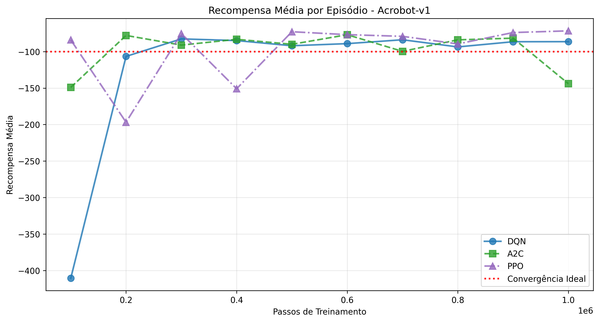

# README - Acrobot

Este diretório contém os scripts e resultados para o treinamento e comparação de algoritmos de Aprendizado por Reforço no ambiente **Acrobot-v1**.

## Conteúdo:

- `train_dqn_acro.py`: Script para treinar o agente DQN.
- `train_a2c_acro.py`: Script para treinar o agente A2C.
- `train_ppo_acro.py`: Script para treinar o agente PPO.
- `comparador.py`: Script para comparar o desempenho dos agentes treinados e gerar tabelas e gráficos.
- `visualizar.py`: Script para visualizar o desempenho de um agente treinado em tempo real.
- `models/`: Diretório onde os modelos treinados são salvos.
- `logs/`: Diretório para logs do TensorBoard.
- `resultados/`: Diretório onde são salvos os resultados da comparação (tabela e gráficos).

## Resultados da Comparação:

A comparação dos algoritmos no ambiente Acrobot-v1 gerou os seguintes gráficos:

### Recompensa Média por Episódio

### Estabilidade da Recompensa

### Tempo de Avaliação por Checkpoint

Para gerar esses resultados, execute o script `comparador.py` dentro deste diretório. 