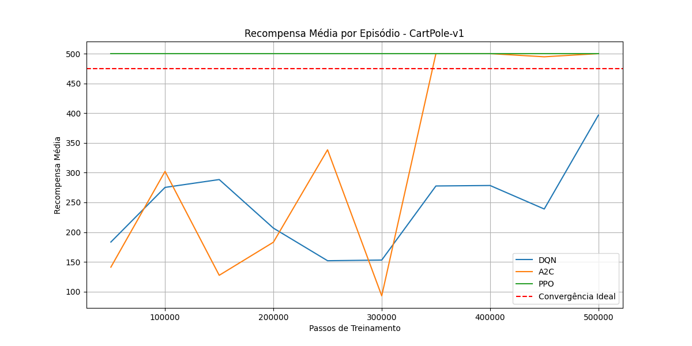
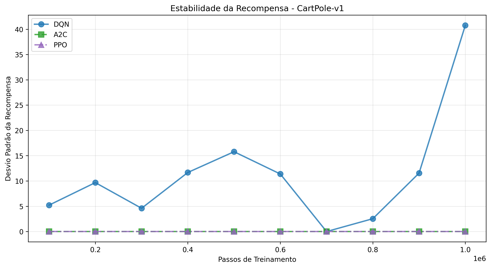

# 🎮 CartPole: Treinamento e Visualização

Este diretório contém os scripts para treinamento e visualização do ambiente CartPole-v1 usando diferentes algoritmos de Aprendizado por Reforço.

## 📁 Estrutura de Arquivos

- `a2c_cart_train.py`: Script de treinamento usando o algoritmo A2C
- `dqn_cart_train.py`: Script de treinamento usando o algoritmo DQN
- `ppo_cart_train.py`: Script de treinamento usando o algoritmo PPO
- `comparador.py`: Script para comparação de desempenho entre os algoritmos
- `visualizador.py`: Script para visualização dos modelos treinados

## 📊 Diretórios de Dados

- `models/`: Armazena os modelos treinados e checkpoints
- `logs/`: Armazena logs de treinamento para visualização no TensorBoard
- `resultados/`: Diretório onde são salvos os resultados da comparação (tabela e gráficos)

## 🚀 Como Usar

1. Para treinar um modelo:
   ```bash
   python a2c_cart_train.py  # ou dqn_cart_train.py ou ppo_cart_train.py
   ```

2. Para comparar os modelos:
   ```bash
   python comparador.py
   ```

3. Para visualizar um modelo treinado:
   ```bash
   python visualizador.py
   ```
   - Você pode modificar a variável `ALGO` no início do arquivo para escolher entre "DQN", "A2C" ou "PPO"

## Resultados da Comparação:

A comparação dos algoritmos no ambiente CartPole-v1 gerou os seguintes gráficos:

### Recompensa Média por Episódio



### Estabilidade da Recompensa



### Tempo de Avaliação por Checkpoint


Para gerar esses resultados, execute o script `comparador.py` dentro deste diretório.