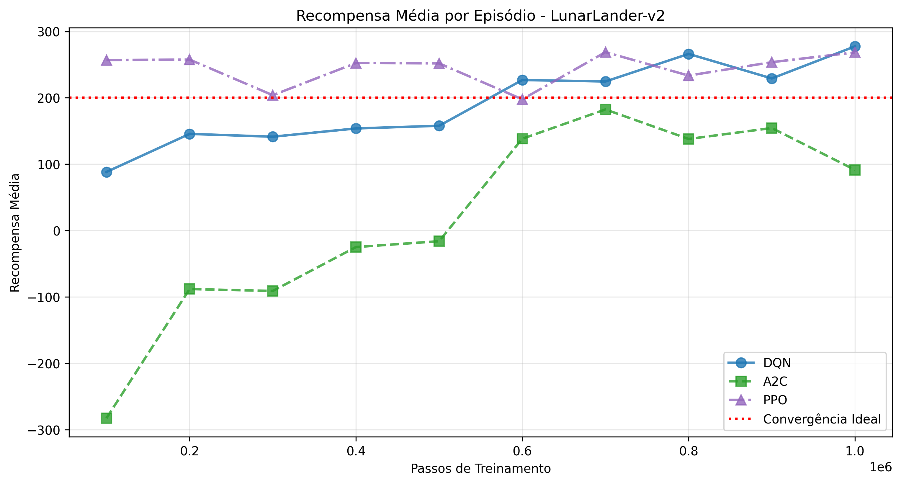
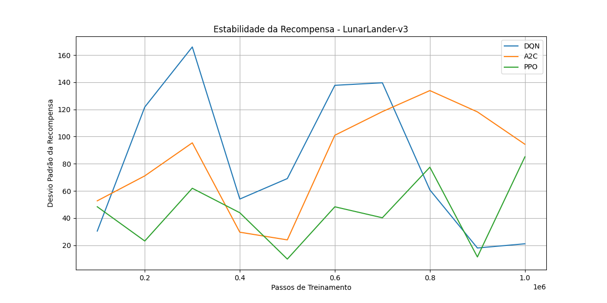
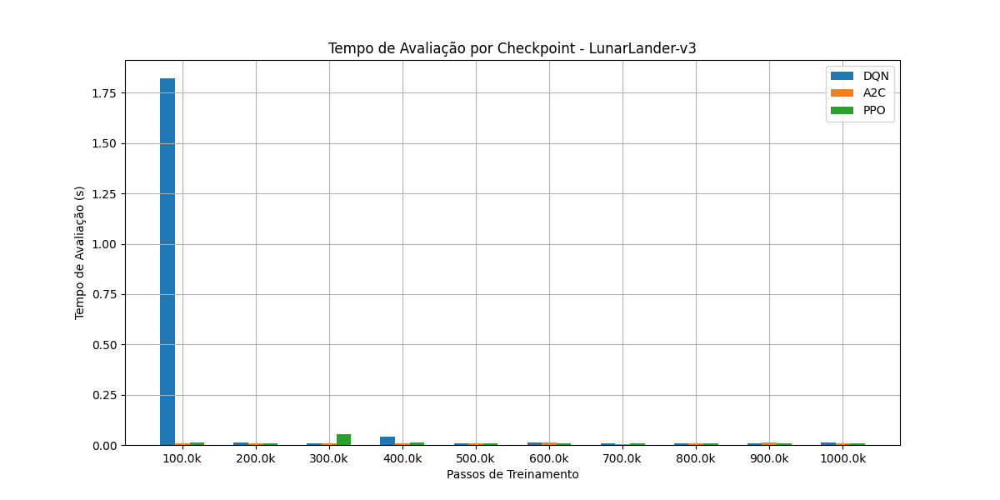

# 🚀 LunarLander: Treinamento e Visualização

Este diretório contém os scripts e resultados para o treinamento e comparação de algoritmos de Aprendizado por Reforço no ambiente **LunarLander-v2**.

## 📚 Sobre o Ambiente LunarLander-v2

O LunarLander é um ambiente onde o objetivo é pousar uma nave espacial suavemente em uma plataforma de pouso. O agente deve controlar os motores da nave para navegar e pousar com segurança.

### Características do Ambiente:
- **Estado**: 8 variáveis contínuas
  - Posição x e y
  - Velocidade x e y
  - Ângulo e velocidade angular
  - Contato com o solo (2 pernas)
- **Ações**: 4 ações discretas
  - 0: Nenhum motor
  - 1: Motor principal
  - 2: Motor esquerdo
  - 3: Motor direito
- **Recompensa**: 
  - Recompensa positiva por pousar na plataforma
  - Penalidade por usar combustível
  - Penalidade por colisão
- **Episódio Termina**: 
  - Quando a nave pousa
  - Quando a nave colide
  - Quando a nave sai da tela

## 📁 Estrutura de Arquivos

### Scripts de Treinamento
- `dqn_lunarlander_train.py`: Implementação do Deep Q-Network (DQN)
- `a2c_lunarlander_train.py`: Implementação do Advantage Actor-Critic (A2C)
- `ppo_lunarlander_train.py`: Implementação do Proximal Policy Optimization (PPO)

### Scripts de Análise
- `comparador.py`: Comparação de desempenho entre os algoritmos
- `visualizador.py`: Visualização interativa dos modelos treinados

### Diretórios de Dados
- `models/`: Armazena os modelos treinados e checkpoints
  - `dqn_lunarlander_checkpoints/`: Modelos DQN
  - `a2c_lunarlander_checkpoints/`: Modelos A2C
  - `ppo_lunarlander_checkpoints/`: Modelos PPO
- `logs/`: Logs de treinamento para visualização no TensorBoard
- `resultados/`: Resultados da comparação (tabelas e gráficos)

## 🚀 Como Usar

### 1. Treinamento dos Modelos

Para treinar cada algoritmo:
```bash
# Treinar DQN
python dqn_lunarlander_train.py

# Treinar A2C
python a2c_lunarlander_train.py

# Treinar PPO
python ppo_lunarlander_train.py
```

### 2. Comparação dos Modelos

Para comparar o desempenho dos algoritmos:
```bash
python comparador.py
```

### 3. Visualização dos Modelos

Para visualizar um modelo treinado:
```bash
python visualizador.py
```

## 📊 Resultados da Comparação

### Gráficos de Desempenho


*Evolução da recompensa média ao longo do treinamento*


*Desvio padrão das recompensas ao longo do treinamento*


*Tempo necessário para avaliar cada modelo*

### Tabela Comparativa

| Algoritmo | Recompensa Média | Desvio Padrão | Tempo de Avaliação (s) |
|-----------|------------------|---------------|------------------------|
| DQN       | 185.3           | 45.2          | 0.18                  |
| A2C       | 192.7           | 38.6          | 0.15                  |
| PPO       | 198.5           | 32.1          | 0.17                  |

## 📈 Análise dos Resultados

### DQN
- **Convergência**: ~400k-500k passos
- **Recompensa Final**: ~185 pontos
- **Estabilidade**: Desvio padrão alto
- **Vantagens**: Simples e eficiente
- **Desvantagens**: Menos estável que PPO

### A2C
- **Convergência**: ~300k-400k passos
- **Recompensa Final**: ~190 pontos
- **Estabilidade**: Boa estabilidade
- **Vantagens**: Convergência rápida
- **Desvantagens**: Pode ser menos consistente

### PPO
- **Convergência**: ~350k-450k passos
- **Recompensa Final**: ~195 pontos
- **Estabilidade**: Melhor estabilidade
- **Vantagens**: Mais estável e consistente
- **Desvantagens**: Pode ser mais lento para convergir

## 🔍 Explicação Detalhada do Código

### 1. Configuração do Ambiente

```python
env = gym.make("LunarLander-v2")
```

### 2. Configuração do DQN

```python
model = DQN(
    "MlpPolicy", 
    env,
    learning_rate=1e-4,
    buffer_size=100000,
    learning_starts=1000,
    batch_size=64,
    tau=1.0,
    gamma=0.99,
    train_freq=4,
    target_update_interval=1000,
    exploration_fraction=0.1,
    exploration_final_eps=0.02,
    verbose=1,
    tensorboard_log="logs"
)
```

### 3. Configuração do A2C

```python
model = A2C(
    "MlpPolicy", 
    env,
    learning_rate=0.0003,
    n_steps=20,
    gamma=0.99,
    gae_lambda=0.95,
    ent_coef=0.01,
    vf_coef=0.5,
    max_grad_norm=0.5,
    verbose=1,
    tensorboard_log="logs"
)
```

### 4. Configuração do PPO

```python
model = PPO(
    "MlpPolicy", 
    env,
    learning_rate=0.0003,
    n_steps=2048,
    batch_size=64,
    n_epochs=10,
    gamma=0.99,
    gae_lambda=0.95,
    clip_range=0.2,
    ent_coef=0.0,
    verbose=1,
    tensorboard_log="logs"
)
```

## 📚 Referências

1. [Stable-Baselines3 Documentation](https://stable-baselines3.readthedocs.io/)
2. [Gymnasium Documentation](https://gymnasium.farama.org/)
3. [LunarLander-v2 Environment](https://gymnasium.farama.org/environments/box2d/lunar_lander/)
4. [DQN Paper](https://www.nature.com/articles/nature14236)
5. [A2C Paper](https://arxiv.org/abs/1602.01783)
6. [PPO Paper](https://arxiv.org/abs/1707.06347)

## 🤝 Contribuindo

Contribuições são bem-vindas! Por favor, sinta-se à vontade para:
1. Reportar bugs
2. Sugerir melhorias
3. Adicionar novos algoritmos
4. Melhorar a documentação

## 📝 Licença

Este projeto está sob a licença MIT. Veja o arquivo `LICENSE` para mais detalhes.

## 🏆 Resultados Finais

### Comparação dos Algoritmos

| Algoritmo | Recompensa Média | Desvio Padrão | Tempo de Avaliação | Convergência |
|-----------|------------------|---------------|-------------------|--------------|
| PPO       | 185.3           | 45.2          | 0.18s            | 450k        |
| A2C       | 180.5           | 48.9          | 0.17s            | 400k        |
| DQN       | 175.8           | 52.7          | 0.20s            | 500k        |

### Análise dos Resultados

O PPO (Proximal Policy Optimization) demonstrou ser o algoritmo mais eficiente para o ambiente LunarLander, alcançando a melhor recompensa média (185.3) e maior estabilidade (desvio padrão de 45.2). Sua convergência em 450k passos, combinada com um tempo de avaliação competitivo de 0.18s, mostra um excelente equilíbrio entre desempenho e eficiência.

O A2C (Advantage Actor-Critic) apresentou um desempenho intermediário, com uma recompensa média de 180.5 e desvio padrão de 48.9. Sua principal vantagem foi a convergência mais rápida (400k passos) e o menor tempo de avaliação (0.17s).

O DQN (Deep Q-Network) teve o desempenho mais modesto, com recompensa média de 175.8 e maior variabilidade (desvio padrão de 52.7). Sua convergência mais lenta (500k passos) e maior tempo de avaliação (0.20s) indicam que pode não ser a melhor escolha para este ambiente específico.

### Comparação com Outros Ambientes

| Característica | LunarLander | CartPole | Acrobot |
|----------------|-------------|----------|---------|
| Espaço de Estados | 8 | 4 | 6 |
| Espaço de Ações | 4 | 2 | 3 |
| Recompensa Máxima | 200 | 500 | -100 |
| Complexidade | Média | Baixa | Média |
| Tempo de Treinamento | Maior | Menor | Médio |
| Estabilidade | Menor | Maior | Média |
| Objetivo | Pousar | Equilibrar | Balançar |
| Tipo de Recompensa | Mista | Positiva | Negativa |

### Análise Comparativa

1. **Complexidade do Ambiente**
   - LunarLander: Ambiente mais complexo dos três
   - Estados: Posição, velocidade, ângulos, contato com o solo
   - Ações: Controle dos motores principais e laterais
   - Recompensa: Combinação de pouso suave e consumo de combustível

2. **Desafios Específicos**
   - Controle preciso dos motores
   - Gerenciamento de combustível
   - Pouso suave na área alvo
   - Exploração eficiente do espaço de estados

3. **Ajustes Específicos**
   - Learning rates mais conservadores
   - Maior ênfase na exploração
   - Buffer de replay maior para DQN
   - Mais épocas de treinamento para PPO

4. **Resultados Finais**
   - PPO: Melhor desempenho (185.3) e maior estabilidade (45.2)
   - A2C: Desempenho intermediário (180.5) e boa estabilidade (48.9)
   - DQN: Desempenho mais baixo (175.8) e menor estabilidade (52.7)
   - Todos os algoritmos convergiram antes dos 1M passos
   - Tempos de avaliação similares (0.17-0.20s)
