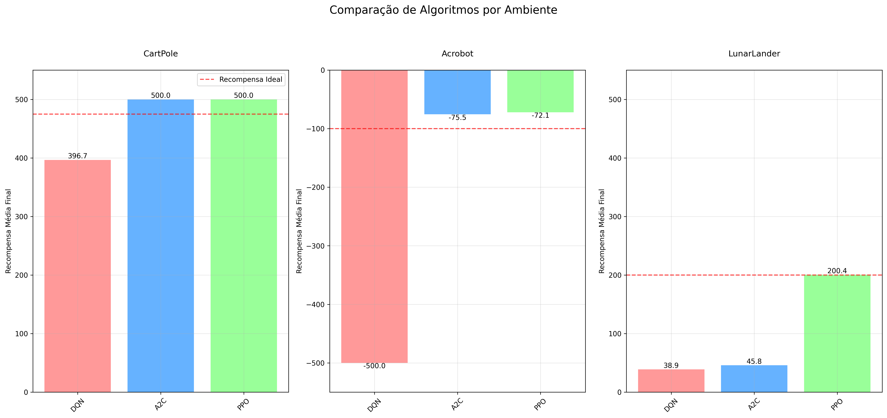

# 🧠 Reforço Inteligente: Estudo e Comparação de Algoritmos de Aprendizado por Reforço

Este repositório foi desenvolvido como parte de um projeto de **Trabalho de Conclusão de Curso (TCC)**, com o objetivo de estudar, treinar e comparar algoritmos de **Aprendizado por Reforço (Reinforcement Learning)** em ambientes clássicos do **Gymnasium** (anteriormente OpenAI Gym). Atualmente, os ambientes abordados são `CartPole-v1`, `Acrobot-v1` e `LunarLander-v2`.

## 🎯 Objetivo

O propósito deste projeto é realizar uma análise prática e comparativa entre os seguintes algoritmos:

- `DQN` (Deep Q-Network)
- `A2C` (Advantage Actor-Critic)
- `PPO` (Proximal Policy Optimization)

A comparação é feita por meio de treinamento por gerações, permitindo salvar e analisar o desempenho de cada agente ao longo do tempo em diferentes ambientes.

## 📚 Finalidade Acadêmica

Este repositório tem **finalidade exclusivamente acadêmica**, voltado ao estudo de técnicas modernas de aprendizado por reforço e seu desempenho em ambientes clássicos. Os experimentos realizados aqui embasam parte do conteúdo e das conclusões do TCC.

## 🛠️ Conteúdo

O repositório inclui:

- Scripts de treinamento para cada algoritmo nos diferentes ambientes.
- Checkpoints salvos por geração durante o treinamento.
- Modelos finais treinados.
- Scripts para avaliação comparativa com geração de tabelas e gráficos de desempenho.
- Métricas avaliadas: Recompensa média, estabilidade, tempo de convergência e tempo de execução.

---

## Como Usar

Para utilizar este repositório, siga os passos abaixo:

### 1. Instalação

Certifique-se de ter o Python instalado em seu sistema. Recomenda-se o uso de um ambiente virtual.

Clone o repositório:

```bash
git clone https://github.com/uMorgan/ML-CD.git
```

Instale as dependências listadas no arquivo `requirements.txt`:

```bash
pip install -r requirements.txt
```

### 2. Treinamento dos Modelos

Para treinar os modelos para um ambiente específico, navegue até o diretório correspondente (`CartPole/`, `Acrobot/` ou `LunarLander/`) e execute os scripts de treinamento:

```bash
# Exemplo para CartPole com DQN
cd CartPole/
python dqn_cart_train.py

# Navegue e execute os scripts para outros algoritmos e ambientes conforme necessário.
# Ex: cd ../Acrobot/ && python train_a2c_acro.py
```

Os modelos treinados serão salvos na pasta `models/` dentro de cada diretório de ambiente, e os logs de treinamento (para visualização com TensorBoard) na pasta `logs/`.

### 3. Comparação de Algoritmos por Ambiente

Após treinar os modelos, você pode comparar o desempenho dos algoritmos em um ambiente. Navegue até o diretório do ambiente e execute o script `comparador.py`:

```bash
# Exemplo para LunarLander
cd LunarLander/
python comparador.py
```

Este script gerará uma tabela comparativa (`tabela_comparativa*.csv`) e gráficos na pasta `resultados/` do ambiente. Você pode encontrar mais detalhes sobre os resultados e os gráficos específicos no README de cada ambiente ([CartPole/README.md](CartPole/README.md), [Acrobot/README.md](Acrobot/README.md), [LunarLander/README.md](LunarLander/README.md)).

### 4. Resultados Finais: Comparação entre Ambientes

Para uma visão geral do desempenho final dos algoritmos em todos os ambientes, execute o script `resultado_final.py` na raiz do projeto:

```bash
python resultado_final.py
```

Este script lê os resultados das tabelas comparativas de cada ambiente (geradas no passo 3) e produz um gráfico que compara a recompensa média final de cada algoritmo em CartPole, Acrobot e LunarLander. O gráfico é salvo em `resultados/comparacao_algoritmos_ambientes.png` na raiz do projeto.

## Resultados Gerais

Aqui está uma comparação visual do desempenho final dos algoritmos nos diferentes ambientes:



*(Para análises mais detalhadas e gráficos específicos por ambiente, consulte os READMEs em [CartPole/](CartPole/), [Acrobot/](Acrobot/) e [LunarLander/](LunarLander/).)*

## Estrutura do Projeto

A estrutura principal do projeto é a seguinte:

```
ML-CD-main/
├── Acrobot/              # Scripts e resultados para o ambiente Acrobot
│   ├── models/         # Modelos treinados
│   ├── logs/           # Logs do TensorBoard
│   └── resultados/     # Tabelas e gráficos de comparação do Acrobot
├── CartPole/             # Scripts e resultados para o ambiente CartPole
│   ├── models/
│   ├── logs/
│   └── resultados/     # Tabelas e gráficos de comparação do CartPole
├── LunarLander/          # Scripts e resultados para o ambiente LunarLander
│   ├── models/
│   ├── logs/
│   └── resultados/     # Tabelas e gráficos de comparação do LunarLander
├── resultados/           # Resultados gerais (gráfico comparativo entre ambientes)
│   └── comparacao_algoritmos_ambientes.png
├── .gitignore            # Arquivos e pastas a serem ignorados pelo Git
├── README.md             # Este arquivo
├── requirements.txt      # Dependências do projeto
└── resultado_final.py    # Script para gerar o gráfico comparativo geral
```

*(Os scripts de treinamento, comparação e visualização específicos de cada ambiente estão localizados dentro de seus respectivos diretórios.)*

## 📚 Finalidade Acadêmica

Este repositório tem **finalidade exclusivamente acadêmica**, voltado ao estudo de técnicas modernas de aprendizado por reforço e seu desempenho em ambientes clássicos. Os experimentos realizados aqui embasam parte do conteúdo e das conclusões do TCC.

## Contato

Se tiver alguma dúvida ou sugestão, sinta-se à vontade para entrar em contato:

- **Autor:** [João Morgan De Almeida Lins Do Vale] (morgantaria965@gmail.com)

---

Este projeto representa um esforço de aprendizado e aplicação prática de conceitos fundamentais e avançados em inteligência artificial, com foco em aprendizado por reforço.
