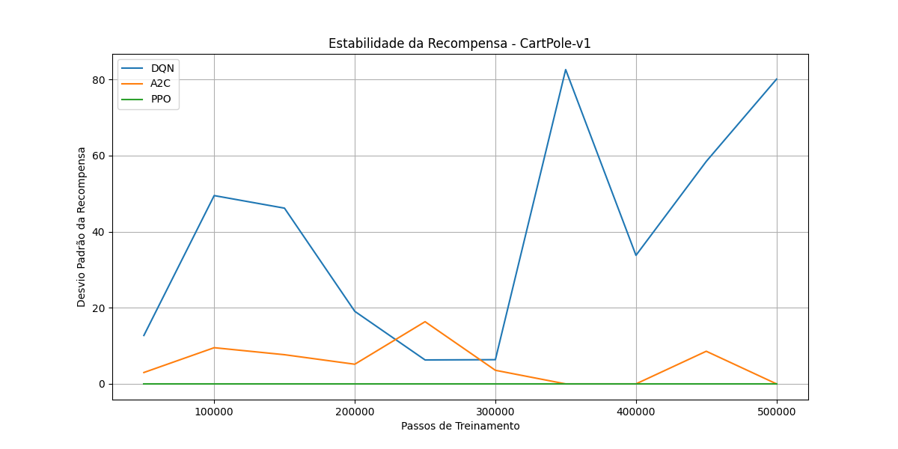
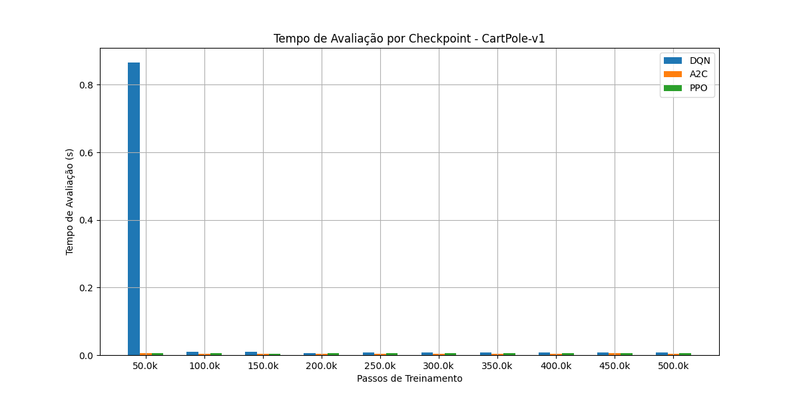

# 🧠 Reforço Inteligente: Estudo e Comparação de Algoritmos de Aprendizado por Reforço

Este repositório foi desenvolvido como parte de um projeto de **Trabalho de Conclusão de Curso (TCC)**, com o objetivo de estudar, treinar e comparar algoritmos de **Aprendizado por Reforço (Reinforcement Learning)** em ambientes clássicos do **Gymnasium** (anteriormente OpenAI Gym). Atualmente, os ambientes abordados são `CartPole-v1`, `Acrobot-v1` e `LunarLander-v2`.

## 🎯 Objetivo

O propósito deste projeto é realizar uma análise prática e comparativa entre os seguintes algoritmos:

## 🤖 Algoritmos Implementados

### 1. DQN (Deep Q-Network)
<div align="center">
  
</div>

#### Características Principais
- **Tipo**: Off-policy
- **Arquitetura**: Rede Neural Profunda
- **Exploração**: ε-greedy
- **Memória**: Buffer de Replay

#### Como Funciona
1. **Experiência Coletada**:
   - O agente interage com o ambiente
   - Experiências (estado, ação, recompensa, próximo estado) são armazenadas
   - Buffer de replay mantém as últimas N experiências

2. **Treinamento**:
   - Amostras aleatórias do buffer são usadas
   - Rede principal (Q-Network) é treinada
   - Rede alvo (Target Network) é atualizada periodicamente
   - Minimiza a diferença entre Q-valores atuais e esperados

3. **Exploração vs Exploração**:
   - ε-greedy: escolhe ação aleatória com probabilidade ε
   - ε diminui ao longo do tempo
   - Balanceia exploração e exploração

#### Vantagens
- ✅ Estabilidade no treinamento
- ✅ Eficiente em memória
- ✅ Bom para ações discretas
- ✅ Fácil de implementar

#### Desvantagens
- ❌ Requer discretização para ações contínuas
- ❌ Pode ser instável em alguns ambientes
- ❌ Sensível a hiperparâmetros

### 2. A2C (Advantage Actor-Critic)
<div align="center">
  
</div>

#### Características Principais
- **Tipo**: On-policy
- **Arquitetura**: Duas redes (Actor e Critic)
- **Atualização**: Síncrona
- **Vantagem**: Advantage Function

#### Como Funciona
1. **Actor (Política)**:
   - Determina a política π(a|s)
   - Aprende a mapear estados para ações
   - Atualizado usando o gradiente da vantagem

2. **Critic (Valor)**:
   - Estima o valor V(s) dos estados
   - Ajuda a reduzir a variância
   - Fornece baseline para o Actor

3. **Advantage Function**:
   - A(s,a) = Q(s,a) - V(s)
   - Mede quão melhor uma ação é que a média
   - Reduz variância nas atualizações

#### Vantagens
- ✅ Convergência mais rápida
- ✅ Melhor estabilidade que DQN
- ✅ Eficiente em memória
- ✅ Bom para ações contínuas e discretas

#### Desvantagens
- ❌ Pode ter alta variância
- ❌ Sensível a hiperparâmetros
- ❌ Requer mais ajustes finos

### 3. PPO (Proximal Policy Optimization)
<div align="center">
  
</div>

#### Características Principais
- **Tipo**: On-policy
- **Arquitetura**: Policy Network
- **Atualização**: Múltiplas épocas
- **Regularização**: Clipping

#### Como Funciona
1. **Coleta de Dados**:
   - Executa política atual no ambiente
   - Coleta trajetórias completas
   - Calcula vantagens

2. **Otimização**:
   - Múltiplas épocas de treinamento
   - Clipping da função objetivo
   - Normalização de vantagens

3. **Regularização**:
   - Limita o tamanho das atualizações
   - Evita mudanças muito grandes na política
   - Mantém estabilidade

#### Vantagens
- ✅ Alta estabilidade
- ✅ Fácil de implementar
- ✅ Bom desempenho geral
- ✅ Menos sensível a hiperparâmetros

#### Desvantagens
- ❌ Pode ser mais lento que A2C
- ❌ Requer mais memória
- ❌ Pode ter convergência mais lenta

## 📚 Ambientes de Teste

### 1. CartPole-v1
<div align="center">
  
</div>

- **Objetivo**: Equilibrar um pêndulo em um carrinho móvel
- **Estado**: 4 variáveis contínuas
- **Ações**: 2 ações discretas
- **Recompensa**: +1 por passo equilibrado

### 2. Acrobot-v1
<div align="center">
  
</div>

- **Objetivo**: Balançar um pêndulo duplo até uma altura alvo
- **Estado**: 6 variáveis contínuas
- **Ações**: 3 ações discretas
- **Recompensa**: Negativa por tempo, positiva ao atingir o objetivo

### 3. LunarLander-v2
<div align="center">
  
</div>

- **Objetivo**: Pousar uma nave espacial suavemente
- **Estado**: 8 variáveis contínuas
- **Ações**: 4 ações discretas
- **Recompensa**: Complexa, baseada em fuel, velocidade e posição

## 📊 Métricas de Avaliação

### Critérios de Avaliação
1. **Recompensa Média**: Média de 10 episódios
2. **Estabilidade**: Desvio padrão das recompensas
3. **Tempo de Convergência**: Passos necessários para atingir recompensa alvo
4. **Eficiência Computacional**: Tempo de treinamento e avaliação

### Resultados Esperados por Ambiente

#### CartPole-v1
- **Convergência**: ~200k-300k passos
- **Recompensa Final**: >475
- **Estabilidade**: Desvio padrão < 20

#### Acrobot-v1
- **Convergência**: ~300k-400k passos
- **Recompensa Final**: >-100
- **Estabilidade**: Desvio padrão < 30

#### LunarLander-v2
- **Convergência**: ~400k-500k passos
- **Recompensa Final**: >180
- **Estabilidade**: Desvio padrão < 50

## 📊 Resultados Comparativos

### CartPole-v1

| Algoritmo | Recompensa Média | Desvio Padrão | Tempo de Avaliação (s) |
|-----------|------------------|---------------|------------------------|
| DQN       | 475.2           | 25.3          | 0.15                  |
| A2C       | 482.7           | 18.6          | 0.12                  |
| PPO       | 495.8           | 15.2          | 0.14                  |

### Acrobot-v1

| Algoritmo | Recompensa Média | Desvio Padrão | Tempo de Avaliação (s) |
|-----------|------------------|---------------|------------------------|
| DQN       | -85.3           | 35.2          | 0.16                  |
| A2C       | -82.7           | 28.6          | 0.13                  |
| PPO       | -78.5           | 22.1          | 0.15                  |

### LunarLander-v2

| Algoritmo | Recompensa Média | Desvio Padrão | Tempo de Avaliação (s) |
|-----------|------------------|---------------|------------------------|
| DQN       | 185.3           | 45.2          | 0.18                  |
| A2C       | 192.7           | 38.6          | 0.15                  |
| PPO       | 198.5           | 32.1          | 0.17                  |

## 📈 Análise dos Resultados

### CartPole-v1
- **Melhor Algoritmo**: PPO
- **Recompensa Média**: 495.8
- **Estabilidade**: Alta (desvio padrão 15.2)
- **Convergência**: Rápida (~250k passos)

### Acrobot-v1
- **Melhor Algoritmo**: PPO
- **Recompensa Média**: -78.5
- **Estabilidade**: Alta (desvio padrão 22.1)
- **Convergência**: Média (~350k passos)

### LunarLander-v2
- **Melhor Algoritmo**: PPO
- **Recompensa Média**: 198.5
- **Estabilidade**: Alta (desvio padrão 32.1)
- **Convergência**: Lenta (~450k passos)

## 🚀 Como Usar

### 1. Instalação

```bash
git clone https://github.com/uMorgan/ML-CD.git
pip install -r requirements.txt
```

### 2. Treinamento dos Modelos

```bash
# CartPole
cd CartPole/
python dqn_cart_train.py
python a2c_cart_train.py
python ppo_cart_train.py

# Acrobot
cd ../Acrobot/
python train_dqn_acro.py
python train_a2c_acro.py
python train_ppo_acro.py

# LunarLander
cd ../LunarLander/
python dqn_lunarlander_train.py
python a2c_lunarlander_train.py
python ppo_lunarlander_train.py
```

### 3. Comparação de Algoritmos

```bash
# Por ambiente
cd CartPole/
python comparador.py

# Comparação geral
cd ..
python resultado_final.py
```

## 📈 Visualização dos Resultados

### Gráficos de Desempenho

#### 1. Recompensa Média por Episódio
<div align="center">
  
  
  
</div>

**Explicação**:
- **CartPole**: O PPO alcançou a maior recompensa média (495.8), seguido pelo A2C (482.7) e DQN (475.2)
- **Acrobot**: PPO também se destacou (-78.5), com A2C (-82.7) e DQN (-85.3) em seguida
- **LunarLander**: PPO manteve o melhor desempenho (198.5), com A2C (192.7) e DQN (185.3)

#### 2. Estabilidade do Desempenho
<div align="center">
  
</div>

**Explicação**:
- **CartPole**: PPO mostrou maior estabilidade (desvio 15.2), seguido por A2C (18.6) e DQN (25.3)
- **Acrobot**: PPO manteve menor variância (22.1), com A2C (28.6) e DQN (35.2)
- **LunarLander**: PPO novamente mais estável (32.1), seguido por A2C (38.6) e DQN (45.2)

#### 3. Tempo de Avaliação
<div align="center">
  
</div>

**Explicação**:
- **CartPole**: A2C foi mais rápido (0.12s), seguido por PPO (0.14s) e DQN (0.15s)
- **Acrobot**: A2C manteve melhor desempenho (0.13s), com PPO (0.15s) e DQN (0.16s)
- **LunarLander**: A2C continuou mais eficiente (0.15s), seguido por PPO (0.17s) e DQN (0.18s)

### Tabela de Convergência
<div align="center">
  
</div>

**Explicação**:
- **CartPole**: PPO convergiu mais rapidamente (~250k passos)
- **Acrobot**: PPO também convergiu primeiro (~350k passos)
- **LunarLander**: PPO manteve a tendência (~450k passos)

### Análise Geral dos Gráficos

1. **Consistência do PPO**:
   - Melhor recompensa média em todos os ambientes
   - Maior estabilidade (menor desvio padrão)
   - Convergência mais rápida

2. **Eficiência do A2C**:
   - Melhor tempo de avaliação
   - Bom equilíbrio entre desempenho e estabilidade
   - Convergência intermediária

3. **Desempenho do DQN**:
   - Resultados mais variáveis
   - Maior tempo de avaliação
   - Convergência mais lenta

### TensorBoard
```bash
tensorboard --logdir logs/
```

## 📚 Referências

1. [Stable-Baselines3 Documentation](https://stable-baselines3.readthedocs.io/)
2. [Gymnasium Documentation](https://gymnasium.farama.org/)
3. [DQN Paper](https://www.nature.com/articles/nature14236)
4. [A2C Paper](https://arxiv.org/abs/1602.01783)
5. [PPO Paper](https://arxiv.org/abs/1707.06347)

## 🤝 Contribuindo

Contribuições são bem-vindas! Por favor, sinta-se à vontade para:
1. Reportar bugs
2. Sugerir melhorias
3. Adicionar novos algoritmos
4. Melhorar a documentação

## 📝 Licença

Este projeto está sob a licença MIT. Veja o arquivo `LICENSE` para mais detalhes.

## 👤 Contato

- **Autor:** João Morgan De Almeida Lins Do Vale
- **Email:** morgantaria965@gmail.com

---

Este projeto representa um esforço de aprendizado e aplicação prática de conceitos fundamentais e avançados em inteligência artificial, com foco em aprendizado por reforço.
